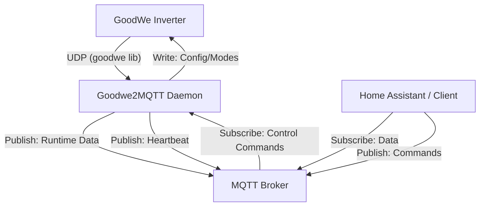

# Contributing to GoodWe2MQTT

Thank you for your interest in contributing to GoodWe2MQTT! This document provides guidelines and instructions for setting up your development environment and contributing to the project.

## Architecture Overview

GoodWe2MQTT is an asynchronous Python daemon that bridges GoodWe inverters with an MQTT broker.



### Core Components
- **`goodwe2mqtt.py`**: The main entry point and core logic.
  - **`main_loop`**: Polling loop that retrieves runtime data from the inverter and publishes it to MQTT.
  - **`mqtt_client_task`**: Background task that listens for control commands on the MQTT control topic.
  - **`heartbeat_task`**: Background task that publishes a periodic "online" status.
- **`logger.py`**: Configures logging with file rotation and console output.

## Development Setup

### Prerequisites
- Python 3.11+
- Virtual environment (recommended)

### Environment Setup
1. Clone the repository.
2. Create and activate a virtual environment:
   ```bash
   python3 -m venv .venv
   source .venv/bin/activate
   ```
3. Install dependencies:
   ```bash
   pip install -r requirements.txt
   ```

### Source Layout
- Runtime implementation lives in `src/`.
- Root-level `goodwe2mqtt.py` and `logger.py` are compatibility entrypoints.

## Quality Standards

We use the following tools to maintain code quality:

### Linting (Ruff)
We use [Ruff](https://github.com/astral-sh/ruff) for fast linting and code formatting.
```bash
ruff check .
```

### Type Checking (Mypy)
We use [Mypy](http://mypy-lang.org/) for static type checking.
```bash
mypy . --ignore-missing-imports
```

### Testing (Pytest)
We use [Pytest](https://docs.pytest.org/) for unit testing.
```bash
pytest
```
To run with coverage:
```bash
pytest --cov=.
```

## Contribution Process
1. Fork the repository.
2. Create a feature branch.
3. Implement your changes following Test-Driven Development (TDD) principles.
4. Ensure all quality checks (lint, type check, tests) pass.
5. Submit a Pull Request.
