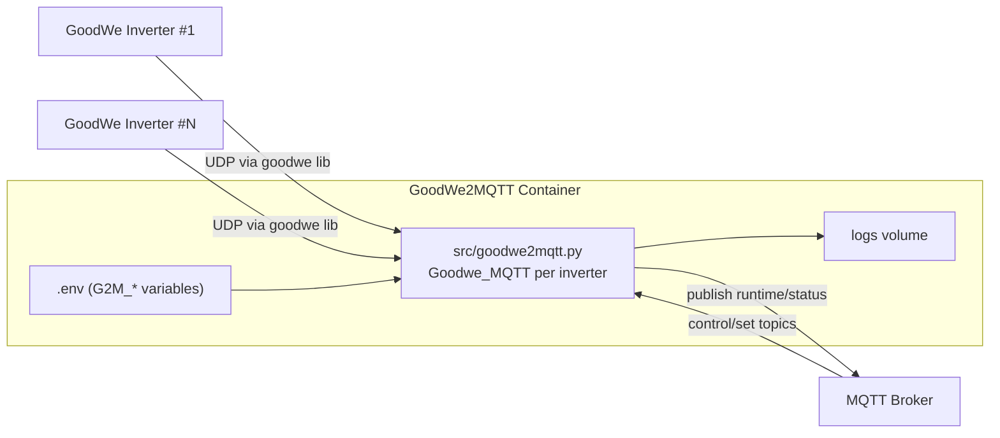

# Architecture

## Repository Layout (Implementation Start)

- `src/`: application implementation modules.
- `goodwe2mqtt.py`, `logger.py`: compatibility entrypoints.
- `docs/`: operator and developer documentation.
